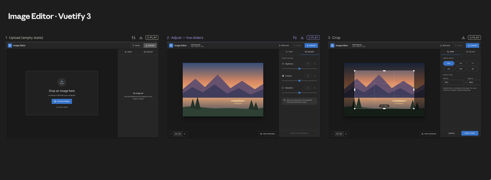

# Image Editor

A browser-based image editor: upload an image, crop it, adjust it with live
sliders, apply a filter, compare with the original, and download the result.
Edits are non-destructive — the original image is always kept, the preview is
derived from it.



## Stack

- [Vue 3](https://vuejs.org/) (`<script setup lang="ts">`, Composition API)
- [Vuetify 3](https://vuetifyjs.com/)
- [Pinia](https://pinia.vuejs.org/)
- TypeScript (strict)
- [Cropper.js v2](https://fengyuanchen.github.io/cropperjs/) (web components) for cropping
- [Vite](https://vite.dev/) as dev server and bundler

## Requirements

- Node.js `^20.19.0` or `>=22.12.0`
- npm (no pnpm/yarn/bun)

## Setup

```bash
npm i
npm run dev
```

## Scripts

```bash
npm run dev           # start the dev server
npm run build          # type-check and build for production
npm run preview        # preview the production build locally
npm run type-check      # vue-tsc --build
npm run test            # unit tests (Vitest)
```

## Project structure

```
src/
├── main.ts               app entry: Pinia, Vuetify plugin, registers cropperjs elements
├── plugins/vuetify.ts    Vuetify instance
├── stores/                Pinia stores (editor state)
├── types/operations.ts    Op / EditDocument types (the JSON schema)
├── render/                colorOps.ts (pure pixel math), render.ts (canvas render)
├── services/              pure/DOM helpers (edit document, parse/plan import, filters, export)
├── composables/           reusable composition logic (live preview rendering)
└── components/editor/     editor UI components
```

## Export and the operations JSON

Export downloads two files with the same base name:

- `<name>-edited.png` — the result, rendered at full resolution from the original
- `<name>-edited.ops.json` — the operations that produce it

The list of operations is the single source of truth for the edits: the live
preview, the exported PNG and the JSON all go through one
`render(original, ops, canvas)` function (`src/render/render.ts`), which crops
and then applies the colour operations with plain pixel math (no CSS `filter`,
no `ctx.filter`), so replaying the JSON on the original file reproduces the PNG.

```json
{
  "version": 1,
  "source": { "name": "photo.jpg", "width": 4000, "height": 3000, "sha256": "e0f3…" },
  "operations": [
    { "type": "crop", "x": 2000, "y": 1500, "width": 1000, "height": 800 },
    { "type": "brightness", "value": 1.2 },
    { "type": "contrast", "value": 1.3 },
    { "type": "saturation", "value": 0.6 },
    { "type": "filter", "name": "sepia", "amount": 1 }
  ]
}
```

- `source.sha256` is the hex SHA-256 of the original file's bytes; `width`/`height` are its natural size.
- Each operation type appears at most once. Neutral operations (factor `1`, filter amount `0`, crop equal to the whole image) are omitted.
- `operations` is in pipeline order, and is applied in array order: `crop` → `brightness` → `contrast` → `saturation` → `filter`.
- `crop` is in **natural pixels of the original image** (integers), not screen pixels.
- The sliders show -100…100; the JSON stores the factor `1 + slider / 100` (`+20` → `1.2`).
- `filter.name` is `grayscale` or `sepia`; `amount` is `0…1` (the UI applies `1`).

### Colour formulas

Channels are normalized to `0…1`, clamped to `0…1` after **each** operation,
and converted back with `Math.round(c * 255)`. Alpha is never changed.
`L = 0.2126 r + 0.7152 g + 0.0722 b`.

| Operation | Formula (per channel `c`) |
|---|---|
| brightness `b` | `c' = c · b` |
| contrast `k` | `c' = (c − 0.5) · k + 0.5` |
| saturation `s` | `c' = L + (c − L) · s` |
| grayscale `a` | `c' = c + (L − c) · a` |
| sepia `a` | `c' = c + (c_s − c) · a`, with `r_s = 0.393r + 0.769g + 0.189b`, `g_s = 0.349r + 0.686g + 0.168b`, `b_s = 0.272r + 0.534g + 0.131b` |

The live preview renders from a copy of the image downscaled to at most 2048 px
on its long side (rebuilt only when the image or crop changes) and is redrawn at
most once per animation frame. Export always renders from the full-resolution
original, so the two match visually but are not guaranteed to be pixel-identical
when the preview is downscaled.

## Import & apply

The **Operations** tab (third tab, next to Crop and Adjust) does the reverse of
export: it applies an `.ops.json` file to the loaded image.

1. Choose a file under **Load operations**. This works even before an image is
   uploaded; the file stays loaded when you upload or replace an image, until
   you press **Clear**.
2. A read-only summary shows the source file name and size, the operations in
   document order (e.g. `Crop 2400 × 1600 at 420, 180`, `Brightness 1.15`,
   `Sepia 100%`) and whether the file **Matches loaded image** (same SHA-256) or
   was **Created for a different image**.
3. **Apply** (enabled with an image and a valid file) *replaces* the current
   edits with the file's operations; nothing is stacked and the original is never
   touched. The preview updates immediately, the sliders and the crop box in the
   Crop / Adjust tabs show the imported values, you can keep editing, and
   **Reset** still returns to the unedited original.

**Validation.** The whole file is rejected, with every problem listed inline in
the tab, if: it is not valid JSON; `version` is not `1`; `source` is missing or
malformed (`name`, integer `width`/`height`, 64-character hex `sha256`); an
operation has an unknown `type` or missing, non-numeric or non-finite fields; an
operation type appears more than once; the operations are not in the canonical
order (version 1 of the format defines `crop → brightness → contrast →
saturation → filter`); `brightness`/`contrast`/`saturation` values are outside
0…2 (the range of the -100…100 sliders); a filter `amount` is not `0` or `1` or
its `name` is not `grayscale`/`sepia`; or a crop has non-integer or negative
coordinates or a width/height below 1.

**Mismatch and confirmations.** If the file was created for a different image
(hash differs — for example when you load an already exported PNG instead of
the original), a dialog warns that the result may differ and that the
operations may be applied a second time; choose **Apply anyway** or **Cancel**.
If the current image already has edits, the dialog also says the current edits
will be replaced. After applying, warnings are shown in the tab:

- a crop partly outside the loaded image is clamped to the image bounds;
- a crop with no overlap is dropped;
- slider values that are not a multiple of 0.01 are rounded to the slider step.

## Status

This is a test task. Project setup (tooling, dependencies, folder structure)
is in place; editor features are being built incrementally.
